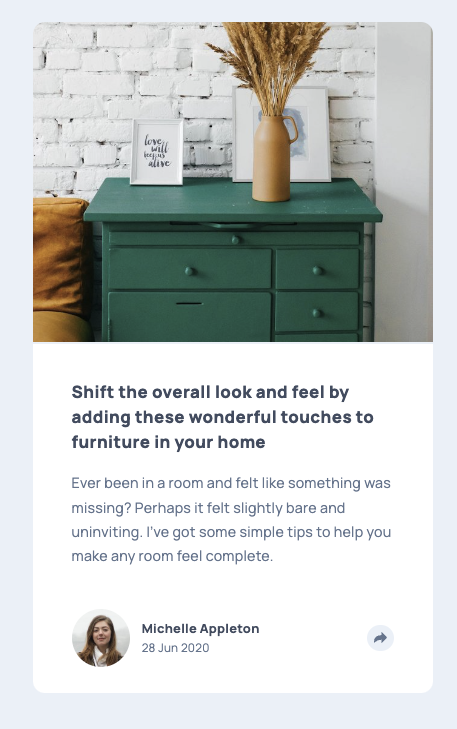
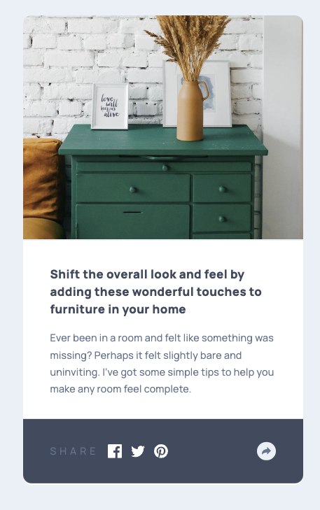

# Frontend Mentor - Article preview component solution

This is a solution to the [Article preview component challenge on Frontend Mentor](https://www.frontendmentor.io/challenges/article-preview-component-dYBN_pYFT). Frontend Mentor challenges help you improve your coding skills by building realistic projects.

## Table of contents

- [Overview](#overview)
  - [The challenge](#the-challenge)
  - [Screenshot](#screenshot)
  - [Links](#links)
- [My process](#my-process)
  - [Built with](#built-with)
  - [What I learned](#what-i-learned)
  - [Helpful feedback](#helpful-feedback)

## Overview

### The challenge

Users should be able to:

- View the optimal layout for the component depending on their device's screen size
- See the social media share links when they click the share icon

### Screenshot




### Links

- [Github repo](https://github.com/codercreative/article-preview-component)
- [Live Site URL](https://chris-article-preview.netlify.app/)

## My process

### Built with

- Semantic HTML5 markup
- CSS custom properties
- Flexbox
- Mobile-first workflow

### What I learned

The biggest hurdle for me in this challenge wasn't so much the JavaScript -- but rather making the overlay fit on all screen sizes.

I tried to achieve an overlap effect of the sub-container over the dresser image on larger screens.

```css
@media (min-width: 1024px) {
  .sub-container {
    display: flex;
    flex-direction: column;
    justify-content: space-between;
    background-color: #fff;
    border-radius: 0px 12px 12px 0;
    padding: 4em 3em 3em 3em;
    z-index: 1; /* Ensures the sub-container overlaps the dresser image */
  }
}
```

Used padding 0.5em to center the arrow in the share button:

```css
.btn-share {
  height: 2em;
  width: 2em;
  border-radius: 50%;
  border: none;
  background-color: var(--light-greyish-blue);
  color: var(--greyish-blue);
  cursor: pointer;
  padding: 0.5em;
}
```

I ran into some specificity issues when targeting the author's name. I don't like the solution below. But it works for now. I guess I could have used an id instead of classes, but I try to only use id's for JavaScript...

```css
.author-wrapper .author-text-wrapper .author-name {
  color: var(--very-dark-greyish-blue);
  font-weight: 800;
}
```

Learned that it is good practice to check element existence before adding event listeners:

```js
if (shareBtn && backBtn && overlay) {
  shareBtn.addEventListener("click", toggleOverlay);
  backBtn.addEventListener("click", toggleOverlay);
}
```

### Helpful feedback

@Pablodev from Frontend Mentor provided very helpful feedback -- e.g. that I make sure to center the content in the middle of the screen using flexbox to mark my project complete and visually balanced.

```css
body {
  display: flex;
  justify-content: center;
  align-items: center;
  min-height: 100vh;
  margin: 0;
}

html {
  height: 100%;
  font-family: "Manrope", sans-serif;
  font-size: 13px;
  background-color: var(--light-greyish-blue);
}
```

The above coding was perfect for mobile view. For desktop, I had to modify `align-items: center` to `align-items: stretch` in `.main-container` for the dresser image and sub-container to align properly.

```css
@media (min-width: 1024px) {
  .main-container {
    flex-direction: row;
    max-width: 1200px;
    min-height: 40vh;
    align-items: stretch;
    justify-content: center;
  }
}
```
